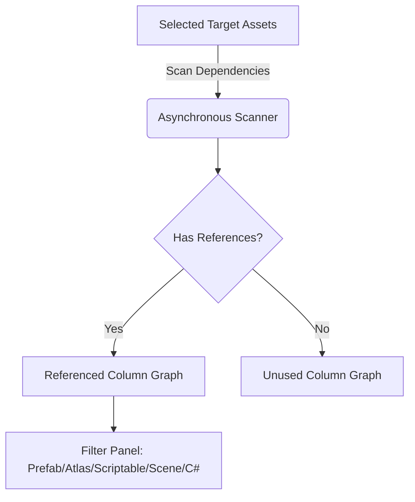

# Unity Editor Utility Toolkit

A collection of high-performance, lightweight Unity editor windows and utilities designed to optimize game development workflows. This toolkit includes tools for visual asset reference tracing, asynchronous asset filtering, data decryption, custom date/time selection, and generic enum searching.

---

## 🚀 Key Features

*   **Asset Reference Finder & Visualizer:** Graph-based, color-coded dependency visualizer with support for multi-target drag & drop, real-time panning/zooming, type filters, and hover previews.
*   **Asynchronous Project Scanning:** Multi-threaded/coroutine-like updating via `EditorApplication.update` to scan large numbers of assets without freezing or locking up the Unity Editor.
*   **Lightweight JSON Formatter & Decryptor:** Secure, built-in AES decryption tool with a zero-dependency custom JSON pretty printer for debugging encrypted logs.
*   **Interactive Date Picker:** A custom UTC/Local calendar selection window triggering C# Actions upon confirmation.
*   **Searchable Generic Enum Picker:** A fast, autofocused search-and-select popup window useful for huge enums.

---

## 📁 Repository Structure

```directory
Unity Tools/
├── README.md
└── Tools/
    ├── DatePickerWindow.cs             # Interactive custom calendar and 24h clock editor window
    ├── Decryptor.cs                    # AES Base64 decryption tool with custom JSON pretty-printer
    ├── GenericEnumPickerWindow.cs      # Searchable popup menu for selecting enum values dynamically
    ├── Filter/
    │   ├── FilteredAssetListWindow.cs  # Unified list view supporting search filtering and asset pinging
    │   └── ShowAllSOandAtlasWindow.cs  # Asynchronous scanner for locating ScriptableObjects & SpriteAtlases
    └── ReferenceFinder/
        ├── AssetReferenceFinderWindow.cs # Main interface for tracking references to selected assets
        ├── DependencyCache.cs          # Active asset post-processor cache for reference lookups
        └── ReferenceGraphView.cs       # Visual node graph built using Unity UI Builder/Visual Elements
```

---

## 🛠️ Installation

Simply drop the `Tools/` folder directly into your Unity project's `Assets` directory:

```bash
YourUnityProject/Assets/Tools/
```

> [!NOTE]
> All scripts are wrapped in `#if UNITY_EDITOR` compiler directives or use Editor assemblies. They will not be included in production builds and require no manual editor-only folder management.

---

## 📖 Feature Walkthrough & Usage

### 1. Asset Reference Finder
*   **Access:** Right-click any asset in the Project window and select **Find References**, or open via **Sachin Saga Tools ➔ 5. Reference Finder**.
*   **Functionality:** 
    *   Finds every asset that depends on or references your target assets.
    *   Includes separate columns for **Referenced** assets and **Unused** assets.
    *   Builds interactive nodes with custom color schemes for quick recognition:
        
        | Color | Asset Type |
        | :--- | :--- |
        | 🟦 **Blue** | Prefab (`.prefab`) |
        | 🟪 **Purple** | Sprite Atlas (`.spriteatlas`) |
        | 🟧 **Orange** | Scriptable Object (`.asset`) |
        | 🟫 **Brown** | Scene (`.unity`) |
        | 🟩 **Green** | C# Script (`.cs`) |
        | ⬜ **Grey** | Others / Unknown |

    *   **Interactive Node Controls:**
        *   *Single Click:* Focuses the node.
        *   *Double Click / Click:* Pings and highlights the asset in the Project panel.
        *   *Mouse Hover:* Displays a mini asset preview/thumbnail.
        *   *Pan & Zoom:* Full canvas navigation via standard mouse dragging and scroll wheel zoom.
    *   **Filter Panel:** Floating toggles let you dynamically hide/show specific asset types on the graph canvas.



### 2. Asset Scanner & Filter
*   **Access:** Open via **Sachin Saga Tools ➔ 6. Filter ➔ Scriptable Objects** or **Sprite Atlases**.
*   **Functionality:**
    *   Uses a split-frame update (`400 steps per frame`) to scan all game assets without lag.
    *   Features a progress bar with custom cancel controls.
    *   Presents matching items in a searchable list view where clicking any entry pings and displays it inside your Project folder structure.

### 3. AES Log Decryptor
*   **Access:** Open via **Sachin Saga Tools ➔ 9. Decryptor**.
*   **Functionality:**
    *   Input AES-encrypted Base64 logs into the text field.
    *   Clicks **Decrypt** to decrypt logs via `AesEncryptor`.
    *   Outputs pretty-printed, indented JSON formatting automatically, allowing you to debug server/client telemetry logs inside the editor.
    *   Includes single-click clipboard copying.

### 4. Date Picker Window
*   **Access:** Triggered programmatically via `DatePickerWindow.ShowWindow()`.
*   **Functionality:**
    *   Features UTC and Local mode toggles.
    *   Includes a "Now" button to reset to the current time.
    *   Month/Year calendar grid selection.
    *   24h input boxes for hours, minutes, and seconds.
    *   Subscribes callbacks to `DatePickerWindow.OnDatePicked`.

```csharp
// Programmatic Usage Example
DatePickerWindow.OnDatePicked = (selectedDate) => 
{
    Debug.Log($"User selected: {selectedDate}");
};
DatePickerWindow.ShowWindow();
```

### 5. Generic Enum Picker
*   **Access:** Triggered programmatically via `GenericEnumPickerWindow.Open(...)`.
*   **Functionality:**
    *   Opens an autofocused search-and-select popup window.
    *   Fuzzy search dynamically filters enum options as you type.

```csharp
// Programmatic Usage Example
GenericEnumPickerWindow.Open(
    currentValue, 
    (newVal) => Debug.Log($"Selected Enum: {newVal}"), 
    "Pick an Option"
);
```

---

## ⚡ Performance Optimization Under the Hood

### 1. Non-Blocking Editor Execution
To prevent the editor from freezing while inspecting massive asset databases, scanning is batched into frame slices:
```csharp
// Example from AssetReferenceFinderWindow.cs
private void ScanStep()
{
    if (!isScanning) return;

    for (int i = 0; i < 50 && scanIndex < scanPaths.Length; i++)
    {
        string path = scanPaths[scanIndex];
        var deps = DependencyCache.Get(path);
        // Process dependencies ...
        scanIndex++;
    }
    // ...
}
```

### 2. Dependency Caching & Post-Processing
The `DependencyCache` saves the results of expensive queries (`AssetDatabase.GetDependencies`). It uses an `AssetPostprocessor` hook to invalidate and clear itself automatically only when assets are imported, deleted, or moved, ensuring search accuracy while maintaining high performance.

---
